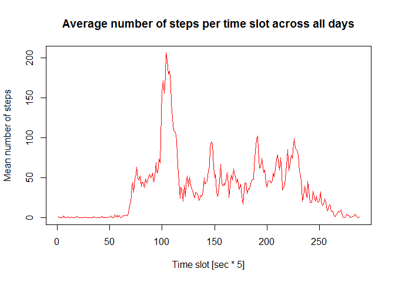

# Activity monitoring

Introduction
============

The assignment uses data from a personal activity monitoring device that collects data at 5 minute intervals through out the day. The data consists of two months sampling from an anonymous individual collected during the months of October and November, 2012 and include the number of steps taken in 5 minute intervals each day.

The original data can be found at https://d396qusza40orc.cloudfront.net and the 
file name is repdata%2Fdata%2Factivity.zip

check existing data subdirectory or create it


```r
if(!file.exists("data")){
    dir.create("data")
 }
```

download data, unzip, clear connection to temp file


```r
fileUrl="https://d396qusza40orc.cloudfront.net/repdata%2Fdata%2Factivity.zip"
setInternet2(use=TRUE)
temp=tempfile()
download.file(fileUrl,temp, method="internal")
unzip(temp,exdir="./data",unzip="internal")
unlink(temp)
```

load data, look at the variables


```r
DF<-read.csv("./data/activity.csv")
str(DF)
```

```
## 'data.frame':	17568 obs. of  3 variables:
##  $ steps   : int  NA NA NA NA NA NA NA NA NA NA ...
##  $ date    : Factor w/ 61 levels "2012-10-01","2012-10-02",..: 1 1 1 1 1 1 1 1 1 1 ...
##  $ interval: int  0 5 10 15 20 25 30 35 40 45 ...
```

change the date factor to date


```r
DF$date<-as.Date(DF$date)
```

*Calculate the total number of steps taken per day*

At this moment we will not take into consideration the NA values 


```r
totStepDay<-tapply(DF$step,DF$date,sum,na.rm=F)
library(reshape2)

DF.totStepDay<-melt(totStepDay)
names(DF.totStepDay)<-c("date","NumbOfSteps")

print(DF.totStepDay)
```

```
##          date NumbOfSteps
## 1  2012-10-01          NA
## 2  2012-10-02         126
## 3  2012-10-03       11352
## 4  2012-10-04       12116
## 5  2012-10-05       13294
## 6  2012-10-06       15420
## 7  2012-10-07       11015
## 8  2012-10-08          NA
## 9  2012-10-09       12811
## 10 2012-10-10        9900
## 11 2012-10-11       10304
## 12 2012-10-12       17382
## 13 2012-10-13       12426
## 14 2012-10-14       15098
## 15 2012-10-15       10139
## 16 2012-10-16       15084
## 17 2012-10-17       13452
## 18 2012-10-18       10056
## 19 2012-10-19       11829
## 20 2012-10-20       10395
## 21 2012-10-21        8821
## 22 2012-10-22       13460
## 23 2012-10-23        8918
## 24 2012-10-24        8355
## 25 2012-10-25        2492
## 26 2012-10-26        6778
## 27 2012-10-27       10119
## 28 2012-10-28       11458
## 29 2012-10-29        5018
## 30 2012-10-30        9819
## 31 2012-10-31       15414
## 32 2012-11-01          NA
## 33 2012-11-02       10600
## 34 2012-11-03       10571
## 35 2012-11-04          NA
## 36 2012-11-05       10439
## 37 2012-11-06        8334
## 38 2012-11-07       12883
## 39 2012-11-08        3219
## 40 2012-11-09          NA
## 41 2012-11-10          NA
## 42 2012-11-11       12608
## 43 2012-11-12       10765
## 44 2012-11-13        7336
## 45 2012-11-14          NA
## 46 2012-11-15          41
## 47 2012-11-16        5441
## 48 2012-11-17       14339
## 49 2012-11-18       15110
## 50 2012-11-19        8841
## 51 2012-11-20        4472
## 52 2012-11-21       12787
## 53 2012-11-22       20427
## 54 2012-11-23       21194
## 55 2012-11-24       14478
## 56 2012-11-25       11834
## 57 2012-11-26       11162
## 58 2012-11-27       13646
## 59 2012-11-28       10183
## 60 2012-11-29        7047
## 61 2012-11-30          NA
```

 *Make a histogram of the total number of steps taken each day*


```r
hist(DF.totStepDay$NumbOfStep,breaks=15,
xlim=c(0,25000),
ylim=c(0,19),
xlab="Number of steps",
col="lightblue",
border="red",
main="Distribution of total number of step per day")
```

 

Note that in this case the number of NA values are not counted as "zero" steps

*Calculate the mean and median of the total number of steps taken per day*


```r
summary_with_NA<-summary(totStepDay)
summary_with_NA
```

```
##    Min. 1st Qu.  Median    Mean 3rd Qu.    Max.    NA's 
##      41    8841   10760   10770   13290   21190       8
```

*Make a time series plot (i.e. type = "l") of the 5-minute interval (x-axis) and the average number of steps taken, averaged across all days (y-axis)*


```r
#calculate the mean
meanStepDayInt<-round(tapply(DF$step,DF$interval,mean,na.rm=T),2)
#arrange data
DF.meanStepDayInt<-melt(meanStepDayInt)
names(DF.meanStepDayInt)<-c("interval","mean_steps")
#make plot
plot(DF.meanStepDayInt$mean_steps,type="l",
xlab = "Time slot [sec * 5]",
ylab= "Mean number of steps",
col="red",
main="Average number of steps per time slot across all days")
```

 

*Which 5-minute interval, on average across all the days in the dataset,
 contains the maximum number of steps?*


```r
MaxValue <- DF.meanStepDayInt[which(DF.meanStepDayInt$mean_step == max(DF.meanStepDayInt$mean_step)), ]
MaxValue[,1]
```

```
## [1] 835
```

corresponding to **8:35** in the morning

*Calculate and report the total number of missing values in the dataset (i.e. the total number of rows with NAs)*


```r
sum(is.na(DF$steps))
```

```
## [1] 2304
```

which in percent is equal to


```r
round(mean(is.na(DF$steps))*100,2)
```

```
## [1] 13.11
```

*Devise a strategy for filling in all of the missing values in the dataset. 
The strategy does not need to be sophisticated. For example, you could
use the mean/median for that day, or the mean for that 5-minute interval, etc.*

There are several missing values, one after the other and for the entire day. It is impossible averaging a missing value with the previous (or previouses) and followings. Furthetmore steps are strongly depending on the time of the day (night time not many steps). A propper way could be subsituting the NA value taken from an average over the same time slot i.e. for the same 5-minutes interval among the non missing values.

*Create a new dataset that is equal to the original dataset but with the missing data filled in*


```r
DF1=DF#copy the data frame

for( i in 1:nrow(DF1) ){
      if (is.na(DF1[i,]$steps)) {#check for the NA values
              val<-DF.meanStepDayInt$interval==DF1[i,]$interval
				#find the corresponding interval or time slot
              DF1[i,]$steps<-DF.meanStepDayInt[val,2]
				#replace NA with the mean steps value  
				#from the mean table at the row where  interval = val
      }
}
```


*Make a histogram of the total number of steps taken each day and calculate  and report the mean and median total number of steps taken per day. Do these values differ from the estimates from the first part of the assignment?*


```r
#calculate sum
totStepDay_Df1<-tapply(DF1$step,DF1$date,sum)

#arrange data
totStepDay_Df1<-melt(totStepDay_Df1)
names(totStepDay_Df1)<-c("date","NumbOfSteps")

#make plot
hist(totStepDay_Df1$NumbOfStep,breaks=15,
xlim=c(0,max(totStepDay_Df1$NumbOfStep)+5000),
ylim=c(0,25),
xlab="Number of steps",
col="lightblue",
border="red",
main="Distribution of total number of step per day no NA values")
```

 


Mean and median total number of steps taken per day:


```r
summary_no_NA<-summary(totStepDay_Df1$NumbOfStep)
summary_with_NA
```

```
##    Min. 1st Qu.  Median    Mean 3rd Qu.    Max.    NA's 
##      41    8841   10760   10770   13290   21190       8
```

```r
summary_no_NA
```

```
##    Min. 1st Qu.  Median    Mean 3rd Qu.    Max. 
##      41    9819   10770   10770   12810   21190
```

Values differ from the original in the central part of the summary, with the exception of the mean value, i.e. 1st and 3rd Qu., median.

*What is the impact of imputing missing data on the estimates of the total daily number of steps?*

Below a side by side plot of the total daily number of steps, without NA and with substitution of NA values with the mean  

```r
par(mfrow=c(1,2))
#make plot
hist(totStepDay_Df1$NumbOfStep,breaks=25,
xlim=c(0,max(totStepDay_Df1$NumbOfStep)+5000),
ylim=c(0,25),
xlab="Number of steps",
col="lightblue",
border="red",
main="total daily steps NA substituted")

hist(DF.totStepDay$NumbOfStep,breaks=25,
xlim=c(0,25000),
ylim=c(0,25),
xlab="Number of steps",
col="lightblue",
border="red",
main="total daily steps without NA")
```

 

There were entire days with NA values and the substitution with the mean value made days to represent a true copy of the mean value table. This implies a growth of the bar plot which includes the mean values.


*Create a new factor variable in the dataset with two levels  "weekday"  and "weekend" indicating whether a given date is a weekday or weekend day*


```r
weekdays1 <- c("lunedì","martedì","mercoledì","giovedì","venerdì")

#convert to factor and specify the levels/labels

DF1$wDay<- factor((weekdays(DF1$date) %in% weekdays1), 
          levels=c(FALSE, TRUE), labels=c('weekend', 'weekday') )
```


*Make a panel plot containing a time series plot (i.e. type = "l") of the 5-minute interval (x-axis) and the average number of  steps taken, averaged across all weekday days or weekend days (y-axis)*


```r
#subset weekend days and week days
DF1.weekend<-subset(DF1,subset=DF1$wDay=="weekend")
DF1.weekdays<-subset(DF1,subset=DF1$wDay=="weekday")

#calculate the mean
DF1.meanStepWeekEnd<-round(tapply(DF1.weekend$steps,DF1.weekend$interval,mean,na.rm=T),2)
DF1.meanStepWeekDay<-round(tapply(DF1.weekdays$steps,DF1.weekdays$interval,mean,na.rm=T),2)
#arrange data 
DF1.meanStepWeekDay_df<-melt(DF1.meanStepWeekDay)
names(DF1.meanStepWeekDay_df)<-c("interval","mean_steps")

DF1.meanStepWeekEnd_df<-melt(DF1.meanStepWeekEnd)
names(DF1.meanStepWeekEnd_df)<-c("interval","mean_steps")


require(ggplot2)
```

```
## Loading required package: ggplot2
```

```r
#more than one plot on same figure
require(gridExtra)
```

```
## Loading required package: gridExtra
```

```r
#make plots
plot1<-(qplot(interval,mean_steps,
	data = DF1.meanStepWeekEnd_df,
	#color = "",
	geom = "line",
	xlab="interval [sec * 5]",
	ylab="week end",
	xlim=c(0,2500),
	ylim= c(0,max(DF1.meanStepWeekDay_df$mean_steps,DF1.meanStepWeekEnd_df$mean_steps)),
	main="Steps mean value across time slots"))
	
plot2<-(qplot(interval,mean_steps,
	data = DF1.meanStepWeekDay_df,
	#color = "",
	xlim=c(0,2500),
	ylim= c(0,max(DF1.meanStepWeekDay_df$mean_steps,DF1.meanStepWeekEnd_df$mean_steps)),
	geom = "line",
	xlab="interval [sec * 5]",
	ylab="week days"))

grid.arrange(plot1,plot2,ncol=1)
```

 
